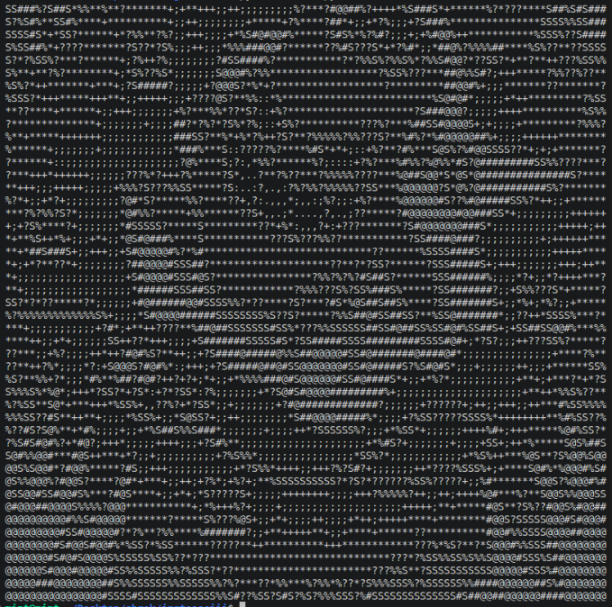

# Image to ASCII Art Generator

A Python script that converts any local image into ASCII art using the `Pillow` library.

The program converts image pixels into grayscale values and maps them to ASCII characters to create text-based artwork.

## Preview

### Original Image


### ASCII Output Preview



Text output:

[View ASCII Output](./ascii_image.txt)

---

## How To Run

### Install dependency

```bash
pip install Pillow
```

### Run the script

```bash
python3 ascii.py
```

Enter the path of the image when prompted:

Example:

```
Enter the image path: /home/user/Pictures/image.jpg
```

or:

```
Enter the image path: download.jpg
```

The generated ASCII art will be saved as:

```
ascii_image.txt
```

---

## About

This project was built while following a Python guide by Kite. Their core logic was used as a learning reference for image pixel manipulation, grayscale conversion, and working with external libraries.

The project was customized to allow users to convert any local image into ASCII art.